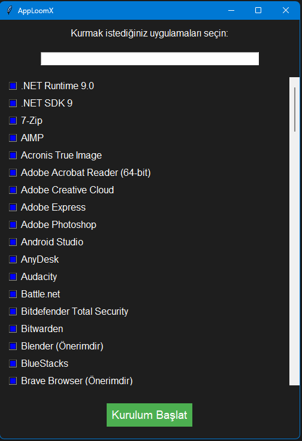

# 🚀 AppLoomX Free - Evrensel Uygulama Kurulum Asistanı

🧠 **AppLoomX**, Python tabanlı, sade Tkinter arayüzüne sahip bir kurulum sihirbazıdır. Kapalı kaynak sürümünde çoklu dil desteği sunar.  
🖱️ Sadece birkaç tıklamayla yüzlerce uygulamayı hızlıca kurabilir, bilgisayarını baştan yaratabilirsin!
 

> 🧒 Geliştirici: **Yiğit**

---

## 🌟 Özellikler

✅ Türkçe dil desteği  
✅ Sade Tkinter arayüz  
✅ Winget ile otomatik kurulum
✅ Masaüstü kısayolu oluşturma

---

## 📸 Ekran Görüntüsü

> *

---

## 🛠️ Kurulum
Releases kısmından kurabilir, python kodunu yapıştırabilir, kapalı kaynak ve gelişmiş sürümü [Discord sunucumuz](https://discord.gg/qA7trgxdVD) dan alabilir veya alttaki kodları kullanarak yapabilirsiniz!
__Not__: **Releases kısmındaki kod Nuitka ile derlenmiştir. Hız için yapılmıştır.**

```bash
git clone https://github.com/EnderGamer6112/AppLoomX-Free.git
cd AppLoomX
pip install -r requirements.txt
python apploomx.py
